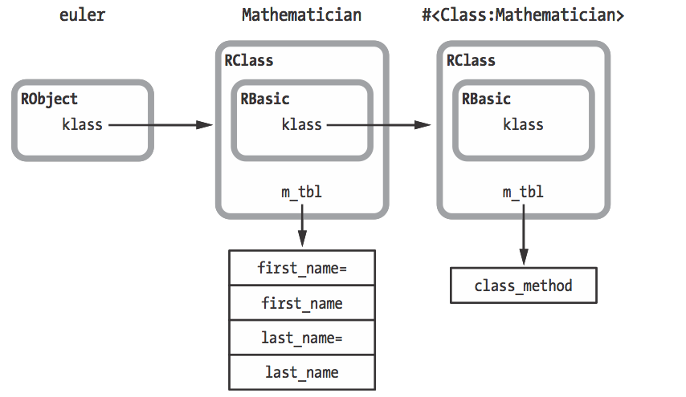

# 问题


既然此处Mathematician类中RBasic的klass指针指向了元类，那么我不由得产生一个疑问：Mathematician.class是如何实现的？

这个疑问我给作者Pat发过邮件，但是他没理我，没办法，自己来寻找答案吧。在得知最后答案之后才明白，原来这里Pat省略了不少细节。

# 解疑

我们先来看看.class方法在Ruby源码内是怎么实现的？  那么怎么查找这个方法？ 有个最简单的方法就是去ruby-doc.org，我们可以直接看到这个方法的C源码实现：

```c
VALUE
rb_obj_class(VALUE obj)
{
    return rb_class_real(CLASS_OF(obj));
}
```


接下来，我只需要去Github的Ruby源码中查找CLASS_OF(obj)的定义就可以了。

经过查找，我们发现CLASS_OF(obj)只是返回RBasic结构体中的klass指针。

那么我们再来看看rb_class_real的定义。

功夫不负有心人，我找到了rb_class_real的如下[定义](https://github.com/ruby/ruby/blob/f830ace8a831a954db7a6aae280a530651a5b58a/object.c#L207)：

```c

VALUE
rb_class_real(VALUE cl)
{
    while (cl &&
        ((RBASIC(cl)->flags & FL_SINGLETON) || BUILTIN_TYPE(cl) == T_ICLASS)) {
    cl = RCLASS_SUPER(cl);
    }
    return cl;
}
```

这段代码中， 会检查是不是Singleton类，或者是T_ICLASS类型的类，这个T_ICLASS实际上是模块被include到类中使用的类型，这个应该是Ruby内部去使用的。 如果是这两种类型，那么rb_class_real会返回超类。否则，就返回RBasic结构体中klass指针指向的类。

但是在书里，Pat说RBasic的klass被设置成了元类，疑问又产生了，Pat说的到底对不对呢？

书中Pat是使用了singleton_class 方法： obj.singleton_class.methods

那么我们继续看看singleton_class的源码，重复上面的查找步骤，我们发现singleton_class的源码定义如下：

```c
static VALUE
rb_obj_singleton_class(VALUE obj)
{
    return rb_singleton_class(obj);
}
```

我们继续去查找rb_singleton_class方法的定义：

```c
VALUE
rb_singleton_class(VALUE obj)
{
    VALUE klass = singleton_class_of(obj);

    /* ensures an exposed class belongs to its own eigenclass */
    if (RB_TYPE_P(obj, T_CLASS)) (void)ENSURE_EIGENCLASS(klass);

    return klass;
}
```

就三行代码，第一行使用singleton_class_of(obj)去取到了klass， 而不是直接去RBasic里面去拿，那么我想，这个singleton_class_of方法一定是做了什么动作。 后面的代码就不用解释了，看注释就好了。最后返回了klass。

那么我们就继续找找singleton_class_of的定义，跟rb_singleton_class定义在同一个[文件](https://github.com/ruby/ruby/blob/2e2bd1c26b21ab3298b32f881bccebc14c7cac3d/class.c#L1539)中：


```c
static VALUE
singleton_class_of(VALUE obj)
{
    VALUE klass;

    if (FIXNUM_P(obj) || FLONUM_P(obj) || STATIC_SYM_P(obj)) {
      no_singleton:
    rb_raise(rb_eTypeError, "can't define singleton");
    }
    if (SPECIAL_CONST_P(obj)) {
    klass = special_singleton_class_of(obj);
    if (NIL_P(klass))
        rb_bug("unknown immediate %p", (void *)obj);
    return klass;
    }
    else {
    switch (BUILTIN_TYPE(obj)) {
      case T_FLOAT: case T_BIGNUM: case T_SYMBOL:
        goto no_singleton;
    }
    }

    klass = RBASIC(obj)->klass;
    if (!(FL_TEST(klass, FL_SINGLETON) &&
      rb_ivar_get(klass, id_attached) == obj)) {
    klass = rb_make_metaclass(obj, klass);
    }

    if (OBJ_TAINTED(obj)) {
    OBJ_TAINT(klass);
    }
    else {
    FL_UNSET(klass, FL_TAINT);
    }
    if (OBJ_FROZEN(obj)) OBJ_FREEZE_RAW(klass);

    return klass;
}
```

这个源码定义好长，前面的两个if语句，大概是限制了字面量和常量不能去创建singleton class，实际上是因为这些值根本没用到C结构体，直到中间部分的代码：    klass = RBASIC(obj)->klass;  这句开始才是我们这个方法的功能主体。

然后经过一个判断，判断这个类是不是singleton class，如果不是，则使用 klass = rb_make_metaclass(obj, klass);方法去make元类。


我们继续看rb_make_metaclass的[源码](https://github.com/ruby/ruby/blob/2e2bd1c26b21ab3298b32f881bccebc14c7cac3d/class.c#L560)， 如下：

```c

VALUE
rb_make_metaclass(VALUE obj, VALUE unused)
{
    if (BUILTIN_TYPE(obj) == T_CLASS) {
    return make_metaclass(obj);
    }
    else {
    return make_singleton_class(obj);
    }
}
```

我们能看得出来， 这个方法中，如果obj的类型是类（也就是，不是实例对象），则使用make_metaclass函数，否则，就使用make_singleton_class函数。

事实上，在Ruby under a microscope后面的章节中，Pat也将介绍，在Ruby内部，metaclass和singleton class的区别，这个这里就不细讲了。

我们继续去看看make_metaclass的[定义](https://github.com/ruby/ruby/blob/2e2bd1c26b21ab3298b32f881bccebc14c7cac3d/class.c#L475)：

```c

static inline VALUE
make_metaclass(VALUE klass)
{
    VALUE super;
    VALUE metaclass = rb_class_boot(Qundef);

    FL_SET(metaclass, FL_SINGLETON);
    rb_singleton_class_attached(metaclass, klass);

    if (META_CLASS_OF_CLASS_CLASS_P(klass)) {
    SET_METACLASS_OF(klass, metaclass);
    SET_METACLASS_OF(metaclass, metaclass);
    }
    else {
    VALUE tmp = METACLASS_OF(klass); /* for a meta^(n)-class klass, tmp is meta^(n)-class of Class class */
    SET_METACLASS_OF(klass, metaclass);
    SET_METACLASS_OF(metaclass, ENSURE_EIGENCLASS(tmp));
    }

    super = RCLASS_SUPER(klass);
    while (RB_TYPE_P(super, T_ICLASS)) super = RCLASS_SUPER(super);
    RCLASS_SET_SUPER(metaclass, super ? ENSURE_EIGENCLASS(super) : rb_cClass);

    OBJ_INFECT(metaclass, RCLASS_SUPER(metaclass));

    return metaclass;
}

```

这个方法也很长，我们看几个关键的地方：

    VALUE metaclass = rb_class_boot(Qundef);

这句代码使用了rb_class_boot方法，实际上是创建了一个新类，实际上就是元类，然后把新类的klass返回，所以这里metaclass，实际上就是新类（元类）的klass。

    FL_SET(metaclass, FL_SINGLETON);

这句就是设置把新创建的类metaclass的flags，设置为元类标记。

后面的代码就是初始化这个元类的相关数据了，这里就不细说了，我们的答案已经基本浮出水面了。直到最后把metaclass返回，也就是元类的klass。


我们再来看看make_singleton_class函数的[定义](https://github.com/ruby/ruby/blob/2e2bd1c26b21ab3298b32f881bccebc14c7cac3d/class.c#L508)，

实际上，跟make_metaclass的行为类似，大家可以自己分析分析。


现在好像是知道答案了，总结一下：

    1.  Mathematician.class实际上是调用的是rb_obj_class函数，它直接返回当前类的klass。
    2.  Mathematician.singleton_class实际调用的是rb_singleton_class函数，它返回的是元类的klass。


事实上，在本书的后面章节，你也会知道，实际上Ruby在创建类的时候，同时也创建了元类。

所以当我们调用class或singleton_class的时候，分别返回的是当前类的klass和元类的klass。


### 结论

那么Pat在书中说：

    In fact, Ruby sets the metaclass to be the class of your new class: It sets the klass pointer of your new RClass structure to point to the metaclass.

这句话，实际上并不恰当。
